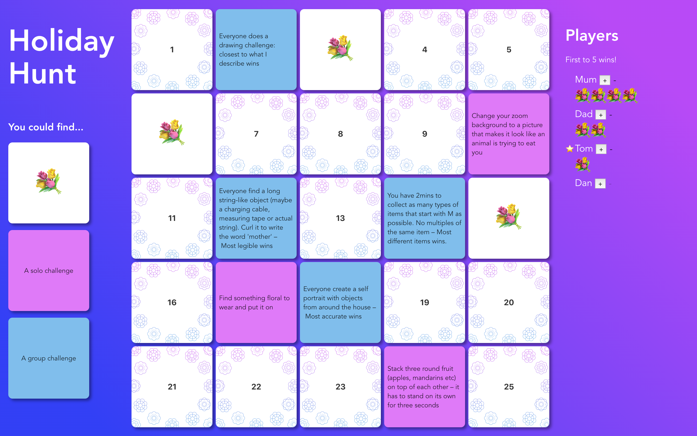

# Easter or other holiday item hunt

This started out as an Easter egg hunt my partner made in Miro to play with her family in a Zoom call. They liked it so much she wanted to repurpose it for mother's day, so I made it a quick web app. Made with `@vue/cli`.



## Project setup
```
yarn install
```

### Compiles and hot-reloads for development
```
yarn serve
```

### Compiles and minifies for production
```
yarn build
```

### Lints and fixes files
```
yarn lint
```

### Customize configuration
See [Configuration Reference](https://cli.vuejs.org/config/).
